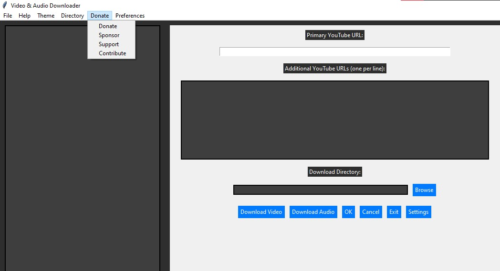
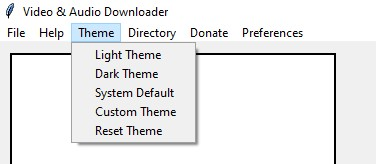
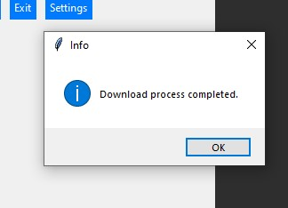
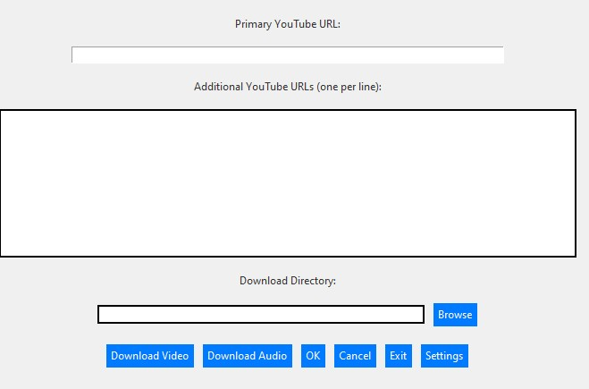
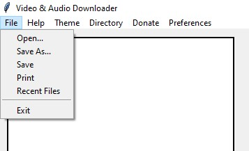

# VStreamPro

**VStreamPro** is a powerful and user-friendly tool for downloading videos from YouTube. Designed for both casual users and developers, it offers a streamlined interface and robust features to help you effortlessly download your favorite youtube videos for free.





#  Author 

 <svg width="400" height="100" viewBox="0 0 400 100" xmlns="http://www.w3.org/2000/svg">
    <rect width="400" height="100" fill="#ffffff"/>
    <text x="10" y="50" font-family="Arial" font-size="40" fill="#333333" font-weight="bold">Kotsorgios</text>
    <text x="10" y="80" font-family="Arial" font-size="40" fill="#1E90FF" font-weight="bold">Panagiotis</text>
  </svg>


- **Background**: Kotsorgios Panagiotis is a software developer with a keen interest in creating tools that enhance user experiences and solve real-world problems. With a strong background in computer science and extensive experience in software development, Kotsorgios is dedicated to building intuitive and efficient solutions.
- **Contact**: For any inquiries, feedback, or collaboration opportunities, you can reach Kotsorgios via email at [your.email@example.com](mailto:your.email@example.com). Connect with Kotsorgios on [LinkedIn](https://www.linkedin.com/in/your-profile) for professional updates and networking.

## Version

**0.0.0.1**

- **Release Date**: September 5, 2024
- **Changelog**:
  - **0.0.0.1**: Initial release with core functionality for downloading YouTube videos.
    - Basic support for downloading videos in high resolution.
    - Command-line interface for specifying video URLs and output paths.
    - Preliminary error handling and user feedback.


## Features

| **Feature**                | **Description**                                               |
|----------------------------|---------------------------------------------------------------|
| **High-Quality Downloads** | Download videos in the highest available resolution.         |
| **User-Friendly Interface**| Easy-to-use command-line interface for quick setup and operation. |
| **Flexible Formats**       | Save videos in various formats such as MP4, MKV, etc.         |
| **Cross-Platform Compatibility** | Compatible with Windows, macOS, and Linux.                  |
| **Automatic Updates**      | Regular updates to adapt to changes in YouTube’s infrastructure. |
| **Batch Downloads**        | Ability to download multiple videos at once.                 |
| **Custom Download Settings** | Configure download quality and format preferences.           |
| **Download History**       | View and manage previous download activities.                |


## GUI Overview

**VStreamPro** features a clean and intuitive graphical user interface (GUI). Here's a detailed look at the main components:

### Main Window

- **Primary URL Entry**: Input field for the main video URL.
- **Additional URLs Text Area**: Area for adding extra video URLs, one per line.
- **Download Directory**: Field to specify where downloaded videos will be saved.
- **Buttons**:
  - **Download Video**: Starts the video download process.
  - **Download Audio**: Initiates audio-only download.
  - **OK**: Executes a general action (e.g., confirming settings).
  - **Cancel**: Cancels current operation and exits.
  - **Exit**: Closes the application.
  - **Settings**: Opens preferences/settings window.
- **Text Display**: Area on the left for displaying additional information or instructions.

### Progress Bar

- **Loading Bar**: Displays the progress of ongoing downloads with percentage completion.

### Status Bar

- **Status Label**: Shows real-time status updates, such as "Ready," "Downloading," or error messages.


## Installation

To set up **VStreamPro**, follow these instructions:

| **Step**                | **Command/Action**                                                                                           |
|-------------------------|-------------------------------------------------------------------------------------------------------------|
| **Clone the Repository** | ```bash<br>git clone https://github.com/yourusername/VStreamPro.git<br>cd VStreamPro<br>```                |
| **Install Dependencies** | Ensure you have Python 3.6 or higher installed. Then, install the required packages:<br>```bash<br>pip install -r requirements.txt<br>``` |
| **Run the Application**  | Start the application with:<br>```bash<br>python vstreampro.py<br>```                                       |


## Usage

To download a video, use the following command:


python vstreampro.py <YouTube-URL> [output-path]

    Replace <YouTube-URL> with the URL of the video you wish to download.
    Optional: Specify an output-path to define where the video will be saved. If not provided, the default path is the current directory.

Examples

bash

python vstreampro.py https://www.youtube.com/watch?v=dQw4w9WgXcQ
python vstreampro.py https://www.youtube.com/watch?v=dQw4w9WgXcQ /path/to/save/

bash


This Markdown format clearly explains the usage of the tool, including the command syntax and examples.


## Troubleshooting

If you encounter issues:

- **HTTP Errors**: Ensure the URL is correct and that you have an active internet connection.
- **Installation Issues**: Verify that all dependencies are installed correctly.
- **Permissions**: Make sure you have write permissions to the output directory.

### Common Errors and Fixes

| **Error**           | **Description**                                 | **Solution**                                      |
|---------------------|-------------------------------------------------|---------------------------------------------------|
| **Invalid URL**     | The provided URL is not recognized.            | Check the URL format and try again.              |
| **Permission Denied** | Lack of write permissions in the output directory. | Change permissions or select a different directory. |
| **Dependency Missing** | Required Python package is not installed.     | Re-run `pip install -r requirements.txt`.         |


## Contributing

Contributions to **VStreamPro** are welcome! If you have suggestions, find bugs, or want to add features, please follow these steps:

1. **Fork the Repository**: Create a personal copy of the repository on GitHub.
2. **Make Changes**: Implement your changes and test thoroughly.
3. **Submit a Pull Request**: Provide a clear description of your changes and submit a pull request for review.

For detailed contribution guidelines, refer to the `CONTRIBUTING.md` file.

## License

This project is licensed under the MIT License. See the `LICENSE` file for more details.

## Contact

For additional information or support, reach out to Kotsorgios Panagiotis at [your.email@example.com](mailto:your.email@example.com).

## GUI Layout

### Main Window Components

| **Component**           | **Description**                               |
|-------------------------|-----------------------------------------------|
| **Primary URL Entry**   | Text field for entering the main video URL.   |
| **Additional URLs**     | Multi-line text area for entering extra URLs. |
| **Directory Entry**     | Field for displaying the selected download directory. |
| **Buttons**             | Various action buttons like "Download Video," "Download Audio," etc. |
| **Text Display**        | Area on the left for displaying large text or instructions. |
| **Progress Bar**        | Bottom bar indicating the download progress and percentage. |
| **Status Label**        | Displays current application status.         |

## Theming and Customization

- **Light Theme**: Features a light color scheme with a white background and dark text.
- **Dark Theme**: Offers a dark color scheme with a dark background and light text.
- **Custom Theme**: Allows users to define their own color preferences.
- **Reset Theme**: Reverts to default settings.

## Preferences and Settings

- **Configure Settings**: Adjust application preferences.
- **Set Language**: Choose the application language.
- **Manage Plugins**: Install or remove additional plugins.

Feel free to modify any sections or add more details based on your project's needs!


## Technologies and Components

**VStreamPro** employs a variety of technologies and tools tailored for YouTube video downloading. Here’s an overview of the key components used in the project:

### Core Technologies

-  **Python**: The main programming language for VStreamPro, used for writing the core functionality and logic of the application.
-  **Tkinter**: The GUI toolkit used to build the desktop application's interface.

### Video Downloading

-  **YouTube**: The primary platform from which videos are downloaded.
-  **youtube-dl**: A command-line tool for downloading videos from YouTube and other sites. VStreamPro leverages this tool for its video downloading capabilities.

### File Formats and Handling

-  **MP4**: A common video format supported by VStreamPro for saving downloaded videos.
-  **MKV**: Another video format option available for downloads.

### Additional Tools

-  **Pip**: Python’s package installer used to manage dependencies and packages required for VStreamPro.
-  **Git**: Version control system used for managing the source code and collaborating on the VStreamPro project.

### Operating Systems

-  **Windows**: One of the operating systems supported by VStreamPro.
-  **macOS**: Another operating system where VStreamPro can be used.
-  **Linux**: Supports various distributions like Ubuntu and Fedora for running VStreamPro.

### Development and Deployment

-  **Docker**: Used for creating isolated environments for development and deployment.
-  **Virtualenv**: Python tool for creating isolated environments to manage dependencies.

Feel free to explore these technologies and tools to understand how **VStreamPro** leverages them to deliver a powerful video downloading solution.


<br> <h2 align="center"> 🌐 MY SOCIALS 🌐 </h2>
<br> <p align="center">
[](https://www.akascape.com) 
[](https://github.com/Akascape) 
[](https://www.reddit.com/user/Akascape)
[](https://www.youtube.com/channel/UC7naboenYq9FAo80aPUkqSw) 
[](https://twitter.com/Akascape) 
<br> <a href='https://ko-fi.com/O5O6P271V' target='_blank'></a>
</p>

<p align="center">
 
 
 
</p>


## Technologies and Tools


## Contributing

We welcome contributions to VStreamPro! Your feedback, bug reports, and feature suggestions help us improve the project. Here’s how you can contribute:

| **Step**                   | **Description**                                                          |
|----------------------------|--------------------------------------------------------------------------|
| **Fork the Repository**    | Create a personal copy of the repository on GitHub.                       |
| **Make Changes**           | Implement your changes and test thoroughly.                               |
| **Submit a Pull Request**  | Provide a clear description of your changes and submit a pull request for review. |

### Contribution Guidelines

| **Guideline**              | **Description**                                                          |
|----------------------------|--------------------------------------------------------------------------|
| **Follow the Coding Standards** | Ensure your code adheres to the project's coding standards.              |
| **Write Clear Commit Messages** | Provide meaningful commit messages that explain the changes made.       |
| **Test Your Changes**      | Thoroughly test your modifications before submitting a pull request.     |
| **Respect the Project’s License** | Make sure your contributions comply with the project's licensing terms. |


### Icons


## Screenshots and Images

To give you a better understanding of VStreamPro, here are some images and screenshots of the application in action:

### Main Window


### Download Process


### Settings and Preferences


### Progress and Status


Feel free to explore these images to get a visual idea of how the application looks and works. You can also find these images in the `docs/images` directory of the repository.


## Creator

### Kotsorgios Panagiotis

  <!-- Replace with your main icon URL -->

Kotsorgios Panagiotis is a dedicated software developer with a passion for crafting tools that enhance user experiences and solve real-world problems. With extensive experience in software development and a background in computer science, Kotsorgios is committed to delivering intuitive and effective solutions.

### Connect with Me

- **Email**: [your.email@example.com](mailto:your.email@example.com) 
- **LinkedIn**: [LinkedIn Profile](https://www.linkedin.com/in/your-profile) 
- **GitHub**: [GitHub Profile](https://github.com/yourusername) 
- **Twitter**: [@YourTwitterHandle](https://twitter.com/YourTwitterHandle) 

### Main Icon

  <!-- Replace with your main icon URL -->

Feel free to reach out for inquiries, feedback, or collaboration opportunities!


## Creator

### Kotsorgios Panagiotis

  <!-- Replace with your main icon URL -->

Kotsorgios Panagiotis is a dedicated software developer with a passion for crafting tools that enhance user experiences and solve real-world problems. With extensive experience in software development and a background in computer science, Kotsorgios is committed to delivering intuitive and effective solutions.

### Connect with Me

| Platform    | Link                                           | Icon                                                                                          |
|-------------|------------------------------------------------|-----------------------------------------------------------------------------------------------|
| **Email**   | [your.email@example.com](mailto:your.email@example.com) |  |
| **LinkedIn**| [LinkedIn Profile](https://www.linkedin.com/in/your-profile) |  |
| **GitHub**  | [GitHub Profile](https://github.com/yourusername) |  |
| **Twitter** | [@YourTwitterHandle](https://twitter.com/YourTwitterHandle) |  |
| **Facebook**| [Facebook Profile](https://www.facebook.com/yourprofile) |  |
| **Instagram** | [Instagram Profile](https://www.instagram.com/yourprofile) |  |
| **YouTube** | [YouTube Channel](https://www.youtube.com/channel/yourchannel) |  |
| **Website** | [Your Website](https://www.yourwebsite.com) |  |

### Main Icon

  <!-- Replace with your main icon URL -->

Feel free to reach out for inquiries, feedback, or collaboration opportunities!


## Visit Our Website

For more information, live demos, and updates, visit our official website:

[](https://www.yourwebsite.com)

### What You Can Find

- **Live Demos**: Try out the application in real-time and see its features in action.
- **Detailed Documentation**: Access comprehensive guides and tutorials to get started with VStreamPro.
- **Latest News**: Stay updated with the latest developments and feature releases.
- **Community Forum**: Join discussions, share your experiences, and get support from other users.
- **Contact Us**: Reach out for support, feedback, or collaboration opportunities.

### Follow Us for Updates

Stay connected and follow us on our social media channels for the latest updates and news:

| Platform     | Link                                          | Icon                                                                                          |
|--------------|-----------------------------------------------|-----------------------------------------------------------------------------------------------|
| **Twitter**  | [Follow us on Twitter](https://twitter.com/YourTwitterHandle) |  |
| **Facebook** | [Like us on Facebook](https://www.facebook.com/yourprofile) |  |
| **Instagram**| [Follow us on Instagram](https://www.instagram.com/yourprofile) |  |
| **YouTube**  | [Subscribe on YouTube](https://www.youtube.com/channel/yourchannel) |  |

Explore more and keep up with the latest in VStreamPro by visiting our [official website](https://www.yourwebsite.com)!


## Image Gallery

| Image 1 | Image 2 |
|:-------:|:-------:|
|  |  | 
| *Description for Image 1* | *Description for Image 2* | 


| Image 1 | Image 2 |
|:-------:|:-------:|
|  |  | 
| *Description for Image 1* | *Description for Image 2* | 


